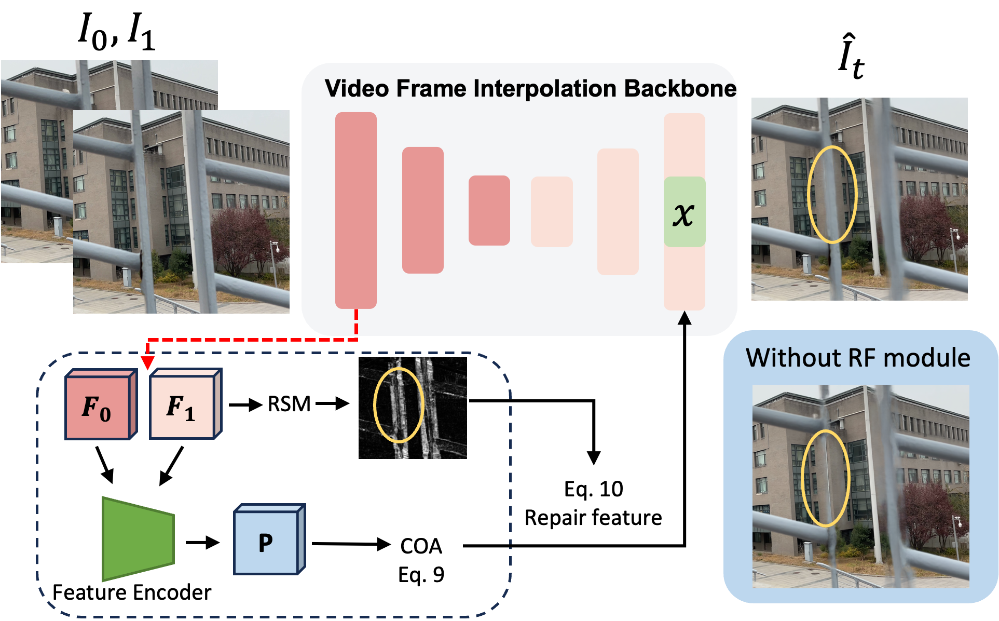

# Learning to Handle Large Obstructions in Video Frame Interpolation

## Abstrct

Video frame interpolation based on optical flow has made great progress in recent years. Most of the previous studies have focused on improving the quality of clean videos. However, many real-world videos contain large obstructions making the video discontinuous. To address this challenge, we propose our Obstruction Robustness Framework (ORF) that enhances the robustness of existing VFI networks in the face of large obstructions. 
The ORF contains two components: (1) A feature repair module that first captures ambiguous pixels in the synthetic frame by a region similarity map, then repairs them with a cross-overlap attention module. (2) A data augmentation strategy that enables the network to handle dynamic obstructions without extra data. To the best of our knowledge, this is the first work that explicitly addresses the error caused by large obstructions in video frame interpolation. 
By using previous state-of-the-art methods as backbones, our method does not only improve the results in original benchmarks but also significantly enhances the interpolation quality for videos with obstructions.

